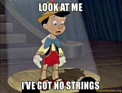
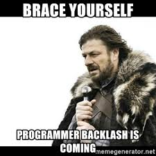
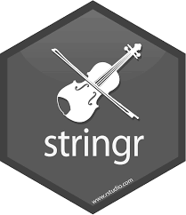
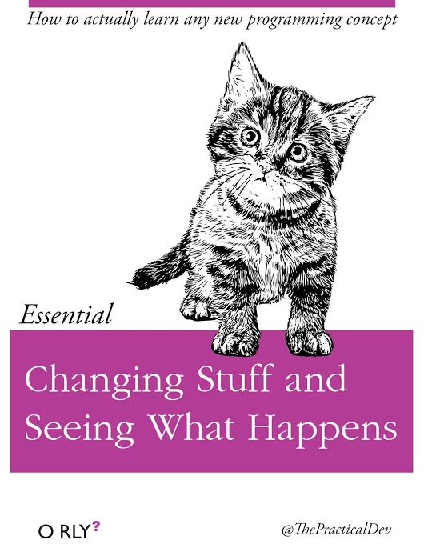
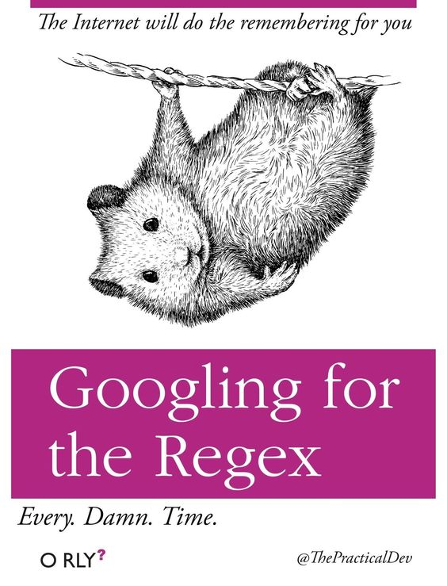
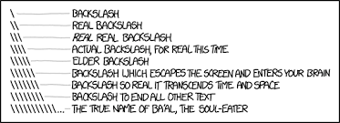
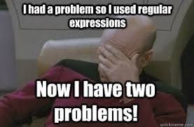
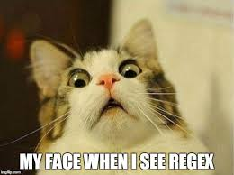
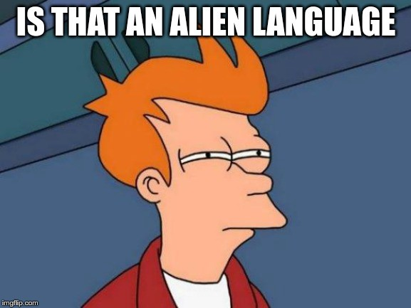
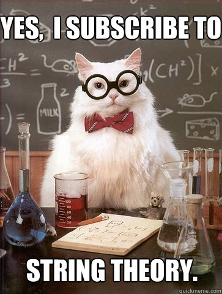

```{r rrr}
#install.packages("datos")
library(tidyverse)
library(datos)
library(stringi)
```
### Creando Strings 

Antes que nada, alguna bibliografía de interes.  

[Handling Strings with R](https://www.gastonsanchez.com/r4strings/character-sets.html) 
[Jugando con regex](https://regexcrossword.com/)  

[Soluciones](https://jrnold.github.io/r4ds-exercise-solutions/strings.html)



#### Puedes crear una cadena utilizando comillas simples o dobles.

```{r 1}

string1 <- "Esta es una cadena de caracteres"
string2 <- 'Si quiero incluir "comillas" dentro de la cadena, uso comillas simples'

string2
```

Para incluir comillas simples o dobles de manera literal en una cadena puedes utilizar backslask o barra invertida \ para “escaparlas” (“escapar” viene de la tecla escape):

\ es un *metacaracter* y tiene un significado especial para un programa de computadora, como un intérprete de shell o una expresión regular (regex).

#### Escape \

```{r 3}

comilla_doble <- "\"" # o '"'
comilla_simple <- '\'' # o "'"

```

#### ¿Cómo harías una string que incluya \ como caracter?

```{r 4}

# string <- "\"
string

# ¿por qué no funciona?
# Si quieres incluir una barra invertida, necesitas duplicarla: "\\".

```

Ten cuidado con que la representación impresa de una cadena no es equivalente a la cadena misma.
La representación muestra las barras utilizadas para “escapar” caracteres, es decir, para sean *interpretados en su sentido literal, no como caracteres especiales*.
Para ver el contenido crudo de una cadena utiliza 'writeLines()'


```{r 6}

x <- c("\"", "\\")

# Cual es la diferencia cuando imprimo con writeLines() 

x
writeLines(x)
```



#### 5 minutos para cortocircuitos

Pensemos

1 - \ es un caracter especial. 

> Escape a metacharacter. In most languages, the way to escape a metacharacter is by adding a backslash character in front of the metacharacter: "\.". When you use a backslash in front of a metacharacter you are “escaping” the character, this means that the character no longer has a special meaning, and it will match itself.

> However, R is a bit different. Instead of using a backslash you have to use two backslashes: "5\\.00". This is because the backslash "\", which is another metacharacter, has a special meaning in R. Libro de Gaston


Existe una serie de otros caracteres especiales. Los más comunes son "\n", para salto de línea, y "\t", para tabulador. 

Puedes ver la lista completa pidiendo ayuda acerca de ": ?'"' o ?"'"

```{r 8}

# tambien hay otros caracteres para incluir simbolos especiales

x <- "\u00b5"
x

```

Usualmente se guardan múltiples cadenas en un vector de caracteres. Puedes crearlo usando c():

```{r otro}
c("uno", "dos", "tres")
```


#### Paquete Stringr

Funciones del paquete *stringr*. Se instala con el grupo de paquetes del tidyverse.



Todassus funciones empienzan con *str_*

#### Largo de cadena

```{r 9}

library(stringr)

# numero de caracteres de una cadena
str_length(c("a", "R para Ciencia de Datos", NA))


# ¿Para que sirve str_c?

str_c("x", "y", sep = ", ")

str_c("x", "y", "z")

# ¿Y str_replace_na()

x <- c("abc", NA)

str_c("|-", x, "-|")

str_c("|-", str_replace_na(x), "-|")


```

Entonces

- Si quieres que los NA se impriman como "NA", utiliza *str_replace_na()*

- Para combinar dos o más cadenas utiliza *str_c()*. Usa el argumento *sep =* para controlar cómo separlas. 

*str_c() es una función vectorizada* que automáticamente recicla los vectores más cortos hasta alcanzar la extensión del más largo:

```{r 10}

str_c("prefijo-", c("a", "b", "c"), "-sufijo")

```


Los objetos de extensión 0 se descartan de manera silenciosa. Esto es particularmente útil en conjunto con if (si):


```{r 11}
nombre <- "Hadley"
hora_del_dia <- "mañana"
cumpleanios <- FALSE

str_c(
  "Que tengas una buena ", hora_del_dia, ", ", nombre,
  if (cumpleanios) " y ¡FELIZ CUMPLEAÑOS!",
  "."
)
```

¿a que otra función te recuerda? *paste()*!

```{r e1}

#¿Cual es la diferencia entre paste() y paste0()?
paste("foo", "bar")
paste0("foo", "bar")

#¿A cual de las anteriores se parece más str_c()

str_c("foo", "bar")
```

Pero, hay una diferencia

```{r e2}

str_c("foo", NA)

paste("foo", NA)

paste0("foo", NA)

```

The function *str_c()* propagates NA, if any argument is a missing value, it returns a missing value. This is in line with how the numeric R functions, e.g. *sum()*, *mean()*, handle missing values. 

However, the paste functions, convert NA to the string "NA" and then treat it as any other character vector.



###  Dividir cadenas

```{r e3}

x <- c("Manzana", "Plátano", "Pera")

str_sub(x, 1, 3)

str_sub(x, -3, -1)

# los números negativos cuentan de manera invertida desde el final
```

Puedes extraer partes de una cadena utilizando *str_sub()*. Al igual que la cadena, *str_sub()* tiene como argumentos start (inicio) y end (fin), que indican la posición (inclusiva) del subconjunto que se quiere extraer.

```{r 12}
# ¿Que pasa si le pido esto?

str_sub("a", 1, 5)

```


```{r 13}
# también puedes utilizar str_sub() en forma de asignación para modificar una cadena:

str_sub(x, 1, 1) <- str_to_lower(str_sub(x, 1, 1))
```

Arriba utilizamos *str_to_lower()* para cambiar el texto a minúsculas.

También puedes utilizar *str_to_upper()* o *str_to_title()*, si quieres modificar el texto a mayúsculas o formato título, respectivamente

### Locales

No todos los idiomas son iguales.

EL tidyverse es políglota.

```{r 14}

# La lengua turca tiene dos i: una con punto y otra sin punto
# Tienen diferentes reglas para convertirlas en mayúsculas

str_to_upper(c("i", "ı"))

str_to_upper(c("i", "ı"), locale = "tr")

# El entorno local o locale se especifica con un código de idioma ISO 639, que es una abreviación de dos letras

```

El *locale* modifica (1) reemplazos especiales en los caracteres, sino (2) tambien el orden


```{r 15}
x <- c("arándano", "espinaca", "banana")

str_sort(x, locale = "es")  # Español

str_sort(x, locale = "haw") # Hawaiano

```

Las funciones *order()* y *sort()* de R Base ordenan las cadenas usando el locale actual.

Si quieres un comportamiento consistente a través de diferentes computadoras, sería preferible usar *str_sort()* y *str_order()*, que aceptan un argumento adicional para definir el locale


### Buscar coincidencia de patrones con expresiones regulares

Las expresiones regulares son un lenguaje conciso que te permite describir patrones en cadenas de caracteres. Toma un tiempo entenderlas, pero una vez que lo hagas te darás cuenta que son extremadamente útiles.



##### Coincidencias básicas

```{r 16}

x <- c("manzana", "banana", "pera")

str_view(x, "an") # para que sirve esta función?

```

*str_view()* y *str_view_all()*. Estas funciones toman un vector de caracteres y una expresión regular y te muestran cómo coinciden. 

```{r 17}

str_view(x, ".a.")
```

Agregar . significa que coincide con cualquier caracter (excepto un salto de línea)

Hechos: 

- . busca cualquier caracter 

Problema: ¿cómo buscar una coincidencia con el caracter “.”?

*Al igual que en las cadenas, las expresiones regulares usan la barra invertida, \, para “escapar” los comportamientos especiales.*

Por lo tanto, para buscar un ., necesitas la expresión regular *\.*

*Expresion regular = \.*

```{r 18}
x <- c("abc", "a.c", "bef")
#str_view(x, "a\.c")

# un garron... no corrío ¿que pasa?

```

Estamos usando cadenas para representar una expresión regular y en ellas \ también se usa como símbolo de “escape”. Por lo tanto, para crear la expresión regular \. necesitamos la cadena "\\.".


```{r 19}
# Para crear una expresión regular necesitamos \\, porque esto es lo que va a leer la compu como un \. (mi expresion regular) cuando corra el str_view
punto <- "\\."

# Pero la expresión en sí misma solo contiene una \
writeLines(punto)

# Esto le dice a R que busque el . de manera explícita
str_view(c("abc", "a.c", "bef"), "a\\.c")
```

#### ¿Que pasa si quiero buscar "\" con una expresion regular?

2- *Expresión regular: \\* -> es lo que le tengo que pedir a R que busque.

3- Para crear esa expresión regular necesitas usar una cadena, que requiere también escapar la \. Esto quiere decir que para coincidir literalmente \ necesitas escribir "\\\\" — ¡necesitas cuatro barras invertidas para coincidir una!

```{r 20}

x <- "a\\b"
writeLines(x)
#> a\b

str_view(x, "\\\\")

```

Explain why each of these strings don’t match a \: "\", "\\", "\\\".

>"\": This will escape the next character in the R string.
>"\\": This will resolve to \ in the regular expression, which will escape the next character in the regular expression.
>"\\\": The first two backslashes will resolve to a literal backslash in the regular expression, the third will escape the next character. So in the regular expression, this will escape some escaped character.



#### Anclas

```{r 21}
x <- c("arándano", "banana", "pera")
str_view(x, "^a")
str_view(x, "a$")

# Para que sirve ^ y $?
```

Por defecto, *las expresiones regulares buscarán una coincidencia en cualquier parte de una cadena*. Suele ser útil anclar una expresión regular para que solo busque coincidencias al inicio o al final. Puedes utilizar:

- ^ para buscar la coincidencia al inicio de la cadena.
- $ para buscar la coincidencia al final de la cadena.

Para recordar cuál es cuál, puedes intentar este recurso mnemotécnico que aprendimos de Evan Misshula: si empiezas con potencia (^), terminarás con dinero ($).


```{r 22}
x <- c("pie de manzana", "manzana", "queque de manzana")
str_view(x, "manzana")
str_view(x, "^manzana$")

# Que diferencia las últimas dos funciones?
```

*Para forzar que una expresión regular coincida con una cadena completa, ánclala usando tanto ^ como $*

También puedes coincidir el límite entre palabras con "\b". No utilizamos frecuentemente esta forma en R, pero sí a veces cuando buscamos en RStudio el nombre de una función que también compone el nombre de otras funciones. Por ejemplo, buscaríamos "\bsum\b" para evitar la coincidencia con summarise, summary, rowsum y otras.

*How would you match the literal string "$^$"?*

```{r e5}

str_view(c("$^$", "ab$^$sfas"), "completar", match = TRUE)
```


*Busca palabras con exactamente 3 letras* 

```{r e4}

str_view(stringr::words, "completar", match = TRUE)
```

#### Clases de caracteres y alternativas

Existe una serie de patrones especiales que coinciden con más de un caracter. 
Ya has visto ., que coincide con cualquier caracter excepto un salto de línea. Hay otras cuatro herramientas que son de utilidad:

\d: coindice con cualquier dígito.
\s: coincide con cualquier espacio en blanco (e.g. espacio simple, tabulador, salto de línea).
[abc]: coincide con a, b, o c.
[^abc]: coincide con todo menos con a, b, o c.

Recuerda que para crear una expresión regular que contenga \d o \s, necesitas escapar la \ en la cadena, por lo que debes escribir "\\d" o "\\s"


Utilizar una clase de caracter que contenga en su interior un solo caracter puede ser una buena alternativa a la barra invertida cuando quieres incluir un solo metacaracter en la expresión regular. Muchas personas encuentran que así es más fácil de leer.

```{r 23}
# Buscar de forma literal un caracter que usualmente tiene un significado especial en una expresión regular
# 1
str_view(c("abc", "a.c", "a*c", "a c"), "a[.]c")

# 2
str_view(c("abc", "a.c", "a*c", "a c"), ".[*]c")

# 3
str_view(c("abc", "a.c", "a*c", "a c"), "a[ ]")

```

Esto funciona para la mayoría (pero no para todos) los metacaracteres de las expresiones regulares: $ . | ? * + ( ) [ {. *Desafortunadamente, existen unos pocos caracteres que tienen un significado especial incluso dentro de una clase de caracteres y deben manejarse con barras invertidas para escaparlos: ] \ ^ y -.*

Puedes utiizar una *disyunción* para elegir entre uno más patrones alternativos.
Por ejemplo, *abc|d..a* concidirá tanto con ‘“abc”’, como con "duna". 

Ten en cuenta que la precedencia de | es baja, por lo que abc|xyz coincidirá con abc o xyz, no con abcyz o abxyz. Al igual que en expresiones matemáticas, si el valor de | se vuelve confuso, utiliza paréntesis para dejar claro qué es lo que quieres:

La precedencia de operadores determina el orden en el cual los operadores son evaluados. Los operadores con mayor precedencia son evaluados primero.

```{r 24}
str_view(c("cómo", "como"), "c(ó|o)mo")
```


*Busca palabras terminadas en "ing" o "ise"*

```{r e6}
str_subset(stringr::words, "completar")
```

*Busca un numero de telefono*

```{r e7}
x <- c("123-456-7890", "1235-2351", "4240-1295")
str_view(x, "completar")
```


#### Repetición


```{r 25}

x <- "1888 es el año más largo en números romanos: MDCCCLXXXVIII"

str_view(x, "CC?")

str_view(x, "CC+")

str_view(x, 'C[LX]+')

```


El siguiente paso en poder implica controlar cuántas veces queremos que se encuentre un patrón:

?: 0 o 1
+: 1 o más
*: 0 o más

Ten en cuenta que la precedencia de este operador es alta, por lo que puedes escribir: cantái?s para encontrar tanto voseo americano como de la variante peninsular del español (es decir, cantás y cantáis). Esto quiere decir que en la mayor parte de los usos se necesitarán paréntesis, como bana(na)+.


```{r 26}

# que obtengo?

str_view(x, "C{2}")

str_view(x, "C{2,}")

str_view(x, "C{2,3}")
```

Puedes asi especificar el número de coincidencias que quieres encontrar de manera precisa:

{n}: exactamente n
{n,}: n o más
{,m}: no más de m
{n,m}: entre n y m

```{r 27}
str_view(x, "C{2,3}")
str_view(x, 'C{2,3}?')
```
Por defecto, este tipo de coincidencias son “avaras” (greedy): tratarán de coincidir con la cadena más larga posible. También puedes hacerlas “perezosas” (lazy) para que coincidan con la cadena más corta posible, poniendo un ? después de ellas. 

*Encontra matches que empiecen con 3 consonantes*

```{r e8}

str_view(words, " completar ", match = TRUE)
```


### Agrupamiento y referencias previas

Anteriormente aprendiste sobre el uso de paréntesis para desambiguar expresiones complejas. Los paréntesis también sirven para crear un grupo de captura numerado (número 1, 2 etc.). Un grupo de captura *guarda la parte de la cadena que coincide con la parte de la expresión regular entre paréntesis*. Puedes referirte al mismo texto tal como fue guardado en un grupo de captura utilizando *referencias previas*, como \1, \2 etc. Por ejemplo, la siguiente expresión regular busca todas las frutas que tengan un par de letras repetido.

```{r 28}
str_view(c("banana", "coconut", "cucumber" ,"papaya"), "(..)\\1", match = TRUE)
```


(En breve, también verás cómo esto es útil en conjunto con *str_match()*)

*What patterns will the regular expression \..\..\.. match? How would you represent it as a string?*

```{r e9}
str_view(c(".a.b.c", ".a.b", "....."), c("\\..\\..\\.."), match = TRUE)
```

*Pensemos*

1- (.)\1\1 :
2- "(.)(.)\\2\\1":
3- (..)\1:
4- "(.).\\1.\\1":
5- "(.)(.)(.).*\\3\\2\\1"


respuestas
(.)\1\1: The same character appearing three times in a row. E.g. "aaa"

"(.)(.)\\2\\1": A pair of characters followed by the same pair of characters in reversed order. E.g. "abba".

(..)\1: Any two characters repeated. E.g. "a1a1".

"(.).\\1.\\1": A character followed by any character, the original character, any other character, the original character again. E.g. "abaca", "b8b.b".

"(.)(.)(.).*\\3\\2\\1" Three characters followed by zero or more characters of any kind followed by the same three characters but in reverse order. E.g. "abcsgasgddsadgsdgcba" or "abccba" or "abc1cba".


*¿Qué significan estas expresiones regulares*

1- ^.*$
2- "\\{.+\\}"
3- \d{4}-\d{2}-\d{2}
4- "\\\\{4}"

respuestas

#1 - ^.*$ will match any string. For example: ^.*$: c("dog", "$1.23", "lorem ipsum").

#2 - "\\{.+\\}" will match any string with curly braces surrounding at least one character. #For example: "\\{.+\\}": c("{a}", "{abc}").

#3 - \d{4}-\d{2}-\d{2} will match four digits followed by a hyphen, followed by two digits #followed by a hyphen, followed by another two digits. This is a regular expression that #can match dates formatted like “YYYY-MM-DD” (“%Y-%m-%d”). For example: \d{4}-\d{2}-\d{2}: 2018-01-11

#4- "\\\\{4}" is \\{4}, which will match four backslashes. For example: "\\\\{4}": "\\\\\\\\"


```{r e10}
#This regular expression will match any pair of repeated letters, where letters is #defined to be the ASCII letters A-Z. First, check that it works with the example in the #problem.

str_subset("church", "([A-Za-z][A-Za-z]).*\\1")
```


#### Herramientas

Una advertencia antes de continuar: debido a que las expresiones regulares son tan poderosas, es fácil intentar resolver todos los problemas con una sola expresión regular. En palabras de Jamie Zawinski:

> Cuando se enfrentan a un problema, algunas personas piensan “Lo sé, usaré expresiones regulares.” Ahora, tienen dos problemas.



Ahora que has aprendido los elementos básicos de las expresiones regulares, es tiempo de aprender cómo aplicarlos en problemas reales. En esta sección aprenderás una amplia variedad de funciones de stringr que te permitirán:

- Determinar qué cadenas coinciden con un patrón.
- Encontrar la posición de una coincidencia.
- Extraer el contenido de las coincidencias.
- Remplazar coincidencias con nuevos valores.
- Dividir una cadena de acuerdo a una coincidencia.


 En vez de crear una sola expresión regular compleja, *usualmente es más fácil crear una serie de expresiones regulares más simples*. Si atascaste tratando de crear una sola expresión regular que resuelva tu problema, da un paso atrás y piensa cómo podrías dividir el problema en partes más pequeñas. 
 

 
#### Detectar coincidencias

```{r 29}
x <- c("manzana", "plátano", "pera")
str_detect(x, "e")

```

Para determinar si un vector de caracteres coincide con un patrón de búsqueda, puedes utilizar *str_detect()*. Este devuelve un vector lógico del mismo largo que el input. Recuerda que cuando usas vectores lógicos en un contexto numérico, FALSE (falso) se convierte en 0 y TRUE (verdadero) se convierte en 1, por lo cual puedes sumar o promediar los resultados.


```{r 30}
# ¿Cuántas palabras comunes empiezan con m?
sum(str_detect(palabras, "^m"))

# ¿Qué proporción de palabras comunes terminan con una vocal?
mean(str_detect(palabras, "[aáeéiéoéuú]$"))

```

Cuando tienes condiciones lógicas complejas, (p. ej. encontrar a o b pero no c, salvo que d) suele ser más fácil combinar múltiples llamadas a *str_detect()* con operadores lógicos, que tratar de crear una sola expresión regular. 


```{r 31}

palabras <- c("pie de manzana", "manzana", "queque de manzana", "R") 
# Encuentra todas las palabras que contengan al menos una vocal, y luego niégalo
sin_vocales_1 <- !str_detect(palabras, "[aáeéiíoóuúúü]")

# Encuentra todas las palabras consistentes solo en consonantes (no vocales)
sin_vocales_2 <- str_detect(palabras, "^[^aáeéiíoóuúúü]+$")

identical(sin_vocales_1, sin_vocales_2)

```

Los resultados son idénticos; sin embargo, creemos que la primera aproximación es significativamente más fácil de entender. Si tu expresión regular se vuelve extremadamente compleja, trata de dividirla en partes más pequeñas, dale un nombre a cada parte y luego combínalas en operaciones lógicas.

Un uso común de *str_detect()* es para seleccionar elementos que coincidan con un patrón. Puedes hacer eso con subdivisiones lógicas o utilizando str_subset(), que es un “envoltorio” (wrapper) de esas operaciones.


```{r 32}
# ¿Cuántas palabras comunes empiezan con m?
sum(str_detect(palabras, "^m"))

# ¿Qué proporción de palabras comunes terminan con una vocal?
mean(str_detect(palabras, "[aáeéiéoéuú]$"))

```


¿Son parecidas estas expresiones?
```{r 33}

palabras[str_detect(palabras, "x$")]

str_subset(palabras, "x$")

```

Un uso común de *str_detect()* es para seleccionar elementos que coincidan con un patrón. Puedes hacer eso con subdivisiones lógicas o utilizando *str_subset()*, que es un “envoltorio” (wrapper) de esas operaciones.

```{r 34}

#podria usarlo con filter()

df <- tibble(
  palabra = palabras, 
  i = seq_along(palabra)
)
df %>% 
  filter(str_detect(palabras, "x$"))
```

*str_count()* (count = contar): más que un simple sí o no, te indica cuántas coincidencias hay en una cadena:

```{r 35}
x <- c("manzana", "plátano", "pera")

str_count(x, "a")


# En promedio, ¿cuántas vocales hay por palabra?
mean(str_count(palabras, "[aáeéiíoóuúü]"))

```

```{r 36}

# podria usarlo con mutate()
df %>% 
  mutate(
    vocales = str_count(palabra, "[aáeéiíoóuúü]"),
    consonantes = str_count(palabra, "[^aáeéiíoóuúü]")
  )
```

Entonces...

> str_detect() se usa mas con filter()
> str_count() más con mutate()

> ¿Por qué?


*Como encuentro las 5 palabras mas comunes*

```{r e13}
tibble(word = unlist(str_extract_all(sentences, boundary("word")))) %>%
  mutate(word = str_to_lower(word)) %>%
  count(word, sort = TRUE) %>%
  head(5)
```


Ten en cuenta que las coincidencias nunca se superponen. Por ejemplo, en "abababa", ¿cuántas veces se encontrará una coincidencia con el patrón "aba"? Las expresiones regulares dicen que dos, no tres:


```{r 37}

# cual es la diferencia ente estas funciones
str_count("abababa", "aba")
str_view("abababa", "aba")
str_view_all("abababa", "aba")

# si quiero ver todos los matches, cual uso?
```

#### Extraer coincidencias

Para extraer el texto de una coincidencia utiliza *str_extract()*

```{r 38}

colores <- c("rojo", "amarillo", "verde", "azul", "marrón")
coincidencia_color <- str_c(colores, collapse = "|")
coincidencia_color

# oraciones es un dataset del paquete datos
oraciones

# Ahora, podemos seleccionar las oraciones que contienen un color y extraer luego el color para saber de cuál se trata
tiene_color <- str_subset(oraciones, coincidencia_color)
coincidencia <- str_extract(tiene_color, coincidencia_color)
head(coincidencia)
```

```{r 39}

colores <- c("rojo", "amarillo", "verde", "azul", "marrón")
coincidencia_color <- str_c(colores, collapse = "|")
mas <- oraciones[str_count(oraciones, coincidencia_color) > 1]
str_view_all(mas, coincidencia_color)

```

```{r 40}

# mira el resultado que da str_extract_all()

str_extract(mas, coincidencia_color)
```


¿Te mostró todas las coincidencias?

```{r 41}
colores <- c("rojo", "amarillo", "verde", "azul", "marrón")
coincidencia_color <- str_c(colores, collapse = "|")

str_view_all(mas, coincidencia_color)
```

Este es un patrón de coincidencia común para las funciones de stringr, ya que trabajar con una sola coincidencia te permite utilizar estructuras de datos más simples. Para obtener todas las coincidencias, utiliza *str_extract_all()*. Esta función devuelve una *lista*

Si utilizas *simplify = TRUE* (es decir, simplificar = VERDADERO), *str_extract_all()* devolverá una matriz con las coincidencias más cortas expandidas hasta el largo de las más extensa

```{r 42}
str_extract_all(mas, coincidencia_color, simplify = TRUE)
```


#### Coincidencias agrupadas


puedes utilizar los paréntesis para extraer una coincidencia compleja. Por ejemplo, imagina que quieres extraer los sustantivos de una oración. Como heurística, buscaremos cualquier palabra que venga después de un artículo (el, la, un, una, etc.). Definir qué es una palabra en una expresión regular es un poco complicado, así que aquí utilizaremos una aproximación simple: una secuencia de al menos un caracter que no sea un espacio.

```{r 43}
sustantivo <- "(el|la|los|las|lo|un|una|unos|unas) ([^ ]+)"

tiene_sustantivo <- oraciones %>%
  str_subset(sustantivo) %>%
  head(10)

tiene_sustantivo %>% 
  str_extract(sustantivo)

```


¿Que pasa si usamos *str_match()*?

```{r 44}
tiene_sustantivo %>% 
  str_match(sustantivo)
```

*str_extract()* nos devuelve la coincidencia completa; 
*str_match()* nos entrega cada componente.
En vez de un vector de caracteres, devuelve una matriz con una columna para la coincidencia completa y una columna para cada grupo 

Al igual que con *str_extract()*, si quieres todas las coincidencias para cada cadena, tienes que utilizar *str_match_all()*


(Como era de esperarse, nuestra heurística para detectar sustantivos es pobre, ya que también selecciona adjetivos como “mejor” y preposiciones como “de”.)

Si tus datos están en un tibble, suele ser más fácil utilizar *tidyr::extract()*. Funciona como str_match() pero requiere ponerle un nombre a las coincidencias, las que luego son puestas en columnas nuevas

```{r 45}
tibble(oracion = oraciones) %>% 
  tidyr::extract(
    oracion, c("articulo", "sustantivo"), "(el|la|los|las|un|una|unos|unas) ([^ ]+)", 
    remove = FALSE
  )
```


#### Remplazar coincidencias

*str_replace()* y *str_replace_all()* te permiten remplazar coincidencias en una nueva cadena. Su uso más simple es para remplazar un un patrón con una cadena fija

```{r 46}
x <- c("manzana", "pera", "banana")

str_replace(x, "[aeiou]", "-")

str_replace_all(x, "[aeiou]", "-")

```

En vez de hacer remplazos con una cadena fija, puedes utilizar referencias previas para insertar componentes de la coincidencia. En el siguiente código invertimos el orden de la segunda y la tercera palabra:


```{r 47}
oraciones %>% 
  str_replace("([^ ]+) ([^ ]+) ([^ ]+)", "\\1 \\3 \\2") %>% 
  head(5)
```



##### Divisiones

```{r 48}
oraciones %>%
  head(5) %>% 
  str_split(" ")
```

Usa *str_split()* para dividir una cadena en partes.
Como cada componente podría tener un número diferente de elementos, esto devuelve una lista. 
Si estás trabajando con vectores de extensión 1, lo más fácil es extraer el primer elemento de la lista

```{r 49}

"a|b|c|d" %>% 
  str_split("\\|") %>% 
  .[[1]]
```

Otra opcion es obtener una matriz usando *simplify = TRUE*

```{r 50}
oraciones %>%
  head(5) %>% 
  str_split(" ", simplify = TRUE)
```


Y si quiero dividir por palabras?

```{r 51}
x <- "Esta es una oración. Esta es otra oración."
str_view_all(x, boundary("word"))
```

En vez de dividir una cadena según patrones, puedes hacerlo definiendo límites: caracter, línea, oración o palabra. Para ello, puedes utilizar la función *boundary()* (límite). En el siguiente ejemplo la división se hace por palabra (word).

*Porque es mejor usar boundary() que str_split()?*

```{r e14}
sentence <- "The quick (“brown”) fox can’t jump 32.3 feet, right?"
str_split(sentence, " ")


str_split(sentence, boundary("word"))
```

*Boundary()* remueve correctamente la puntuacion


#### Buscar coincidencias

*str_locate()* y *str_locate_all()* te indican la posición inicial y final de una coincidencia.

Son particularmente útiles cuando ninguna otra función hace exactamente lo que quieres. 
Puedes utilizar *str_locate()* para encontrar los patrones de coincidencia y *str_sub()* para extraerlos y/o modificarlos.


#### Funciones de los ejercicios

¿Qué hace *str_trim()*?
```{r e15}
str_trim(" abc ")

str_trim(" abc ", side = "left")

str_trim(" abc ", side = "right")

```

La función opuesta es *str_pad()*
```{r e16}

str_pad("abc", 5, side = "both")

str_pad("abc", 4, side = "right")

str_pad("abc", 4, side = "left")

```

¿Qué hace *str_wrap()*?

```{r e17}

thanks_path <- file.path(R.home("doc"), "THANKS")
thanks <- str_c(readLines(thanks_path), collapse = "\n")
thanks <- word(thanks, 1, 3, fixed("\n\n"))

# observa el dataset thanks y luego fijate que hace str_wrap()
thanks

cat(str_wrap(thanks, width = 60, indent = 2), "\n") # podria usar exdent =

```


#### Otro tipo de patrones

Cuando utilizas un patrón que es una cadena, este automáticamente es encapsulado en la función *regex()* (regex es la forma abreviada de regular expression, es decir, expresión regular):


```{r 52}
# La manera regular en que escribimos el patrón
str_view(frutas, "nana")
# Es un atajo de
str_view(frutas, regex("nana"))
```

Puedes utilizar los otros argumentos de regex() para controlar los detalles de la coincidencia:

##### *ignore_case = TRUE*

permite que la búsqueda coincida tanto con caracteres en mayúscula como en minúscula. Este argumento siempre utiliza los parámetros de tu locale.

```{r 53}
bananas <- c("banana", "Banana", "BANANA")

str_view(bananas, "banana")
str_view(bananas, regex("banana", ignore_case = TRUE))
```

##### *multiline = TRUE* 
permite que ^ y $ coincidan con el inicio y fin de cada línea, en vez del inicio y fin de la cadena completa.

```{r e18}
x <- "Línea 1\nLínea 2\nLínea 3"

str_extract_all(x, "^Línea")[[1]]

str_extract_all(x, regex("^Línea", multiline = TRUE))[[1]]

```

##### *comments = TRUE*
te permite utilizar comentarios y espacios en blanco para hacer más entendibles las expresiones regulares complejas. Los espacios son ignorados, al igual que todo lo que está después de #.

Para coincidir un espacio de manera literal, tendrías que "escaparlo: "\\ ".

```{r e19}
telefono <- regex("
  \\(?     # paréntesis inicial opcional
  (\\d{3}) # código de área
  [) -]?   # paréntesis, espacio o guión inicial opcional
  (\\d{3}) # otros tres números
  [ -]?    # espacio o guión opcional
  (\\d{3}) # otros tres números
  ", comments = TRUE)

str_match("514-791-8141", telefono)
```


##### *dotall = TRUE*
permite que . coincida con todo, incluidos los saltos de línea (\n).

Existen otras tres funciones que puedes utilizar en vez de *regex()*

##### fixed(): 
busca una coincidencia exacta de la secuencia de bytes especificada. 
Ignora todas las expresiones regulares especiales y opera a un nivel muy bajo. 
Esto te permite evitar formas de “escapado” complejas y puede ser mucho más rápida que las expresiones regulares. La comparación utilizando *microbenchmark* muestra que *fixed()* es casi dos veces más rápida.

ejemplo en libro

IMPORTANTE: ten precaución al utilizar *fixed()* con datos que no estén en inglés. 


```{r 54}

a1 <- "\u00e1"
a2 <- "a\u0301"
c(a1, a2)

a1 == a2

str_detect(a1, fixed(a2))

str_detect(a1, coll(a2))

```

Se renderean de manera idéntica, pero como están definidas de manera distinta, *fixed()* no encuentra una coincidencia. En su lugar, puedes utilizar *coll()*, que definiremos a continuación, ya que respeta las reglas humanas de comparación de caracteres

##### coll(): 
compara cadenas usando reglas de secuenciación (collation) estándar. Esto es útil para buscar coincidencias que sean insensibles a mayúsculas y minúsculas. Ten en cuenta que *coll()* incluye un parámetro para el locale.
Lamentablemente, se utilizan diferentes reglas en diferentes partes del mundo.

```{r 55}
# Esto quiere decir que también tienes que prestar atención a esas 
# diferencias al buscar coincidencias insensibles a mayúsculas y
# minúsculas

i <- c("I", "İ", "i", "ı")
i


str_subset(i, coll("i", ignore_case = TRUE))

str_subset(i, coll("i", ignore_case = TRUE, locale = "tr"))
```

Tanto *fixed()* como *regex()* tienen argumentos para ignorar la diferencia entre mayúsculas y minúsculas (ignore_case); sin embargo, no te permiten elegir tu locale

```{r 56}
stringi::stri_locale_info()
```

Una desventaja de *coll()* es la velocidad. Debido a que las reglas para reconocer qué caracteres son iguales suelen ser complicadas, *coll()* es relativamente más lenta al compararla con *regex()* y *fixed()*


##### Como viste con str_split(), puedes utilizar boundary() para coincidir límites. 
También puedes utilizarla con otras funciones:

```{r 57}
x <- "Esta es una oración."

str_view_all(x, boundary("word"))

str_extract_all(x, boundary("word"))
```


*Extrae la primer palabra de todas las oraciones*

```{r e20}
str_extract(sentences, "[A-ZAa-z]+") %>% head()

```

#### Otros usos de las expresiones regulares.

##### apropos()
busca todos los objetos disponibles en el ambiente global (global environment). Esto es útil si no recuerdas bien el nombre de una función.

```{r 58}
apropos("replace")
```

##### dir()
entrega una lista con todos los archivos en un directorio. El argumento pattern recibe una expresión regular y retorna solo los nombres de archivos que coinciden con ese patrón. Por ejemplo, puedes encontrar todos los archivo de R Markdown en el directorio actual con:

```{r 59}
head(dir(pattern = "\\.Rmd$"))
```

(Si te resulta más cómodo trabajar con “globs”, es decir, especificar los nombres de archivo utilizando comodines, como en *.Rmd, puedes convertirlos a expresiones regulares con la función glob2rx())


#### stringi

- *stringr* es útil cuando estás aprendiendo, ya que presenta un set mínimo de funciones, que han sido elegidas cuidadosamente para manejar las funciones de manipulación de cadenas más comunes

- *stringr* está construido sobre la base del paquete stringi. stringi tiene 244 funciones, frente a las 49 de stringr.

- Si en algún momento te encuentras en dificultades para hacer algo en stringr , vale la pena darle una mirada a stringi.


The function *stringi::stri_rand_lipsum()* generates lorem ipsum text. Lorem ipsum text is nonsense text often used as placeholder text in publishing. The following code generates one paragraph of placeholder text.

```{r e22}
library(stringi)

stringi::stri_rand_lipsum(nparagraphs = 2)

# cuenta el numero de palabras
stri_count_words(head(sentences))

stri_rand_shuffle("The brown fox jumped over the lazy cow.")

stri_duplicated(c(
  "the", "brown", "cow", "jumped", "over",
  "the", "lazy", "fox"
))
```



str_view(words, "^[^aeiou]{3}", match = TRUE)